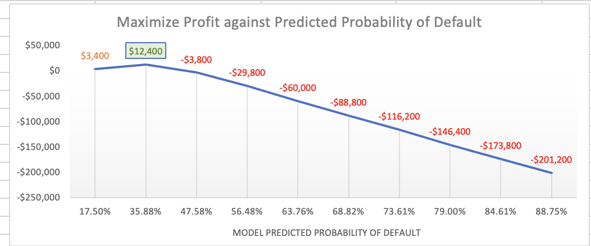

# :money_with_wings: Loan Default Prediction Project

## Objective
To train a model to recognize defaults in a artificially generated dataset, and determine how it can be used to maximize profit.

## Technologies
* Language: Python
* Libraries: scikit-learn, pandas

## Steps & Workflow
1. Artificially generate simplified loan datset with Python: [generate_data.ipynb](https://github.com/linzhongkuan/Predicting_Loan_Defaults_With_Machine_Learning/blob/feature/data_synthetic/generate_data.ipynb)
2. Train the model with Logistic Regression: [model_training.ipynb](https://github.com/linzhongkuan/Predicting_Loan_Defaults_With_Machine_Learning/blob/feature/model_training.ipynb)
3. Visualization and analysis: [See Chart](#insights)
    - [Excel Download](https://github.com/linzhongkuan/Predicting_Loan_Defaults_With_Machine_Learning/blob/feature/result_analysis.xlsx)

## Insights
* __Result__:
    - Trained model has prediction accuracy of 77.25%, with high sensitivity; Strong ability in identifying true positive cases of default.
* __Recommendation__:
    - We can attain a maximum profit of $12,400 by accepting only applicants in the generated dataset who have a model predicted default probability under 35.88%. 

## Limitations
* __Artificially generated dataset__:
    1. Does not reflect real-world patterns in loan applicants who do and and don't default.
    2. Is heavily simplified. Real-world loan datasets involve many more variables than the few used in generating the data.
* __Assumptions__:
    1. Assumed normal distribution of income; Income is typically right-skewed in real world economics.
    2. Assumed a fixed loss of $1000 from each individual default and a fixed profit of $400 from each successful loan; loss and profit is proportional to loan amount in real-world scenarios.